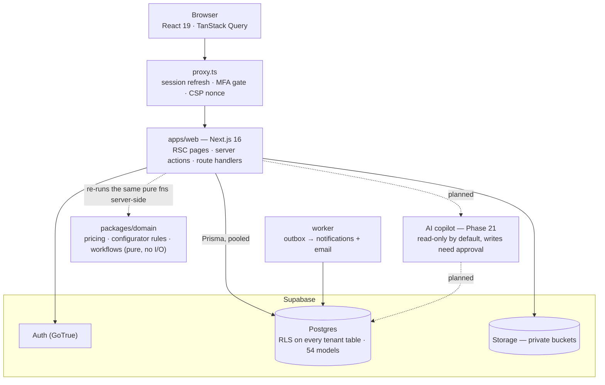

# 🔥 AI EMS — AI-Powered Enterprise Management System

[](https://github.com/shushruth21/ai-ems/actions/workflows/ci.yml)


**A multi-tenant SaaS that runs a make-to-order business end to end — lead → quote → order → production → quality check → shipment → invoice → service — with an AI copilot that can read anything the user can see but never writes without approval.**

[Architecture](docs/architecture/README.md) · [Product Requirements](docs/product/requirements.md) · [Phase Reports](docs/phases/README.md) · [Threat Model](docs/architecture/threat-model.md)

## 🎯 Problem

Make-to-order manufacturers, furniture makers, and fit-out companies stitch together a CRM, a spreadsheet-based product catalog, a separate ERP for production, and a chat thread for approvals — and the quote a salesperson priced never quite matches what shop floor builds or finance invoices. AI EMS puts lead capture, a rule-based product configurator, server-priced quotes, inventory, production, quality, logistics, and billing behind one permission model and one audit trail, so every number downstream traces back to the same server-validated source of truth.

## 🏗️ Architecture



The same pricing and rule-validation functions run client-side for instant feedback and server-side as the only source of truth — the browser never gets the last word on a price. See [docs/architecture](docs/architecture/README.md) for the full C4 set, the multi-tenancy design, and the STRIDE threat model.

## ✨ Key Features

- **Server-authoritative everything** — the product configurator, pricing, and discount policy run as pure functions in `packages/domain`, executed client-side for live feedback and **re-executed server-side** before anything is persisted; the client is never trusted.
- **Row-Level Security on 100% of tenant tables** — every one of the 54 Prisma models is isolated by RLS policy, not application-layer filtering.
- **Permissions as data, not code** — roles are editable bundles of 43 fine-grained permissions, checked on the server for every write, with a full before/after audit log.
- **Rule-based configurator** — `visible_when` rules hide irrelevant questions per product, prices the live answer set, and saves a priced, re-runnable configuration a lead can carry into a quote.
- **Zero-config local stack** — `pnpm dev:local` boots Postgres (Docker), a built-in Supabase Auth emulator, the outbox worker, and the app with one command — no cloud account required to start building.
- **Accessibility as a CI gate** — every route is scanned with `@axe-core/playwright`; the build fails on serious or critical WCAG 2.2 AA violations, not just on request.

## 🚀 Quick Start

**Zero-config, fully local** (PostgreSQL via Docker + a built-in Supabase Auth emulator):

```bash
git clone https://github.com/shushruth21/ai-ems.git
cd ai-ems
corepack enable
pnpm install
pnpm dev:local          # database, migrations, seed, auth emulator and the app
                         # → http://localhost:3000, sign in with the printed demo account
```

**Against your own Supabase project:**

```bash
cp .env.example .env    # Supabase + database values
make doctor              # checks toolchain and .env
make db-deploy           # Prisma migrations + Supabase SQL (RLS, storage, triggers)
make db-seed              # permission catalog + "Demo Industries" sample tenant
make dev                 # http://localhost:3000 — sign in at /login, UI sandbox at /preview
```

Run `make help` to list every task.

## 📊 Engineering Targets

Non-functional requirements the codebase is built and CI-gated against ([full table](docs/product/requirements.md#non-functional-requirements)):

| Area          | Target                                                                    |
| ------------- | ------------------------------------------------------------------------- |
| Performance   | p75 LCP < 2.0s, INP < 200ms; route JS < 200KB gzip                        |
| Availability  | 99.9% monthly                                                             |
| Security      | OWASP ASVS L2 · RLS on 100% of tenant tables · MFA available to all users |
| Accessibility | WCAG 2.2 AA — zero serious/critical issues (automated `axe` scan in CI)   |
| Scale (v1)    | 500 tenants × 200 users · 10M stock movements per tenant                  |

## 🧪 Testing

```bash
pnpm test                # unit + component tests (Vitest)
pnpm test:integration     # database / RLS tests
ENABLE_UI_PREVIEW=true pnpm test:e2e   # Playwright end-to-end + accessibility (axe)
pnpm check                # typecheck + lint + unit tests + formatting — what CI runs
```

## 🛠️ Tech Stack

Next.js 16 · React 19 · TypeScript (strict) · Tailwind CSS v4 · Radix/shadcn · TanStack Query/Table v9 · React Hook Form + Zod · Supabase (Auth, Postgres, Storage, Realtime) · Prisma 7 · pnpm + Turborepo · Vitest · Playwright + axe · Docker

## 📖 Documentation

| Topic                                        | Location                                                       |
| -------------------------------------------- | -------------------------------------------------------------- |
| Architecture overview and C4 diagrams        | [docs/architecture](docs/architecture/README.md)               |
| Architecture Decision Records                | [docs/architecture/adr](docs/architecture/adr/README.md)       |
| Requirements and definition of done          | [docs/product/requirements.md](docs/product/requirements.md)   |
| Phase-by-phase build reports                 | [docs/phases](docs/phases/README.md)                           |
| Operations (SLOs, incidents, DR, runbooks)   | [docs/operations](docs/operations/service-level-objectives.md) |
| Governance (data, retention, responsible AI) | [docs/governance](docs/governance/data-classification.md)      |
| API and event contracts                      | [docs/api/openapi.yaml](docs/api/openapi.yaml)                 |
| Contributing                                 | [CONTRIBUTING.md](CONTRIBUTING.md)                             |
| Security policy                              | [SECURITY.md](SECURITY.md)                                     |

## 📜 License

[MIT](LICENSE). Bundled fonts (Inter, JetBrains Mono) are licensed under SIL OFL 1.1.
