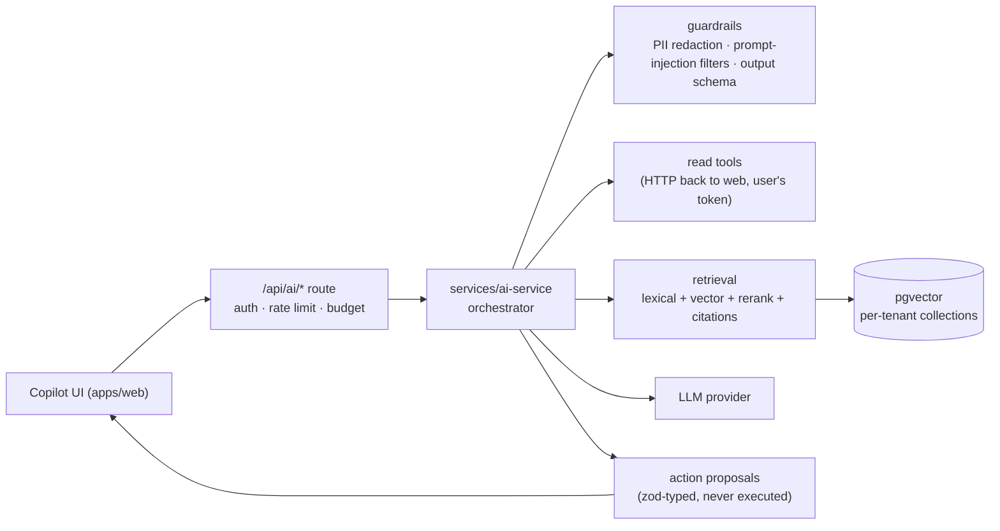

# AI architecture

**Principle:** the AI is an assistant, never an unaudited actor. It reads what the user can read, and it only writes after the user approves.

## Capabilities by phase

| Capability                              | Phase | Mechanism                                                                                  |
| --------------------------------------- | ----- | ------------------------------------------------------------------------------------------ |
| Copilot Q&A, natural-language analytics | 21    | Tool-calling LLM over permission-checked read tools                                        |
| Quote drafting, purchase suggestions    | 21    | LLM proposes a typed action; the user reviews a diff and confirms                          |
| Document search (RAG)                   | 20–21 | Ingestion service → pgvector → hybrid retrieval → cited answers                            |
| Demand and stock forecasting            | 20    | Python models (`ml/forecasting`) trained on tenant history; batch scores stored per item   |
| Dashboard summary, daily brief          | 21    | Scheduled worker job → LLM summary of computed KPIs (numbers come from SQL, not the model) |

## Components

## Guardrails

- **Tenant and permission scope.** Every tool call carries the user's identity. The AI service has no database superuser path to tenant data.
- **Proposals, not writes.** The model returns `{ action, input, rationale }`. The web app validates it, shows the diff, and executes it through the normal server action after the user confirms. The audit log records `actorType=AI, approvedById=user`.
- **Data minimisation.** Only the fields a tool needs are sent. Email addresses and phone numbers are masked unless the user can reveal them.
- **Evaluation.** A golden dataset per capability lives in `evals/`, covering tool selection accuracy, answer faithfulness and refusal behavior. CI blocks a prompt or model change that regresses.
- **Budgets.** Each tenant plan gets token limits, and a user's usage is rate-limited.
- **Provider abstraction.** Anthropic is the default, configured through `AI_PROVIDER` / `AI_MODEL`. Prompts are versioned in `packages/ai-core/prompts`.

## Model risk

See [../governance/ai-model-risk.md](../governance/ai-model-risk.md).
