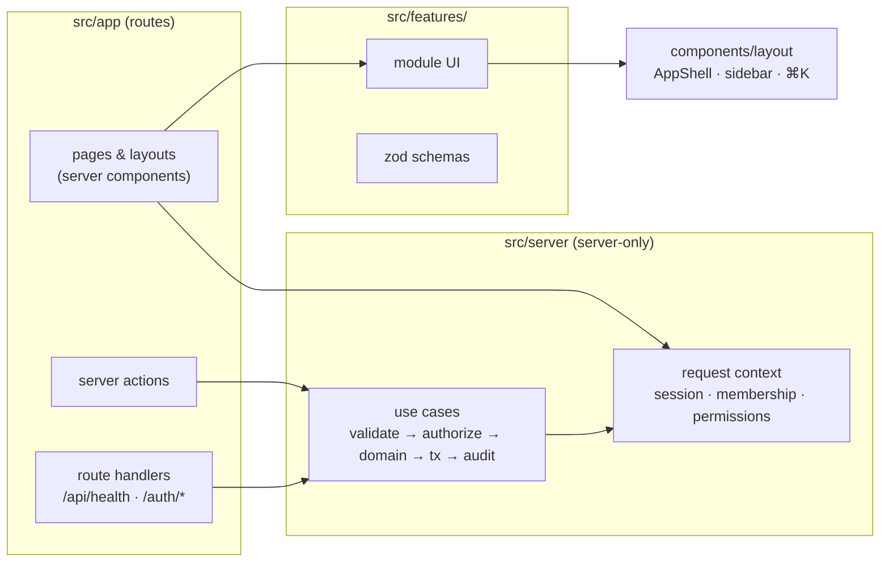
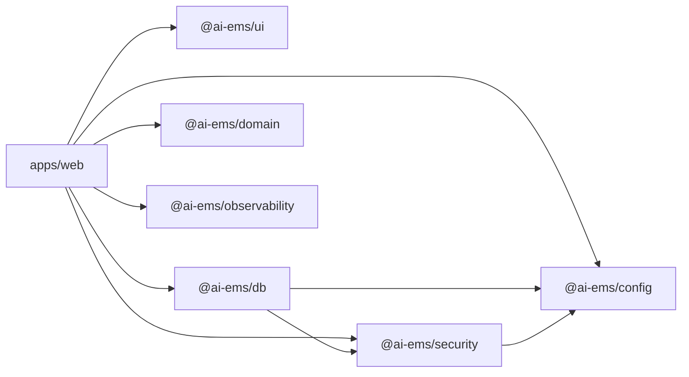

# Components (C4 level 3)

## apps/web

## Packages

| Package                 | Key modules                                                                                                         |
| ----------------------- | ------------------------------------------------------------------------------------------------------------------- |
| `@ai-ems/domain`        | `money/money`, `pricing/price-line`, `workflow/state-machine`, `workflow/machines`, `numbering/document-number`     |
| `@ai-ems/db`            | `client` (Prisma + pg adapter), `tenant` (scoped client), `tenant-scope` (pure guard), `generated/*`                |
| `@ai-ems/security`      | `authorization/permissions`, `authorization/authorize`, `authentication/supabase/{server,client,proxy}`, `http/csp` |
| `@ai-ems/ui`            | `components/ui/*` (32 primitives), `components/data/*`, `hooks/*`, `lib/{format,status,hotkeys,utils}`, `styles/*`  |
| `@ai-ems/config`        | `env`, `env.server`                                                                                                 |
| `@ai-ems/observability` | `logger`                                                                                                            |
