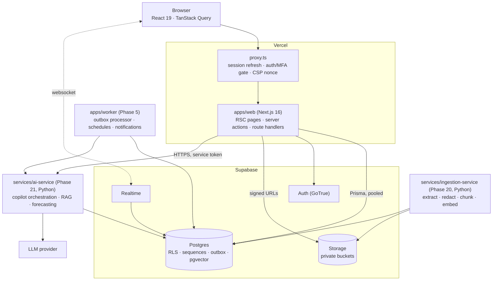

# Containers (C4 level 2)

| Container             | Technology                          | Scales by                    | State                                 |
| --------------------- | ----------------------------------- | ---------------------------- | ------------------------------------- |
| `apps/web`            | Next.js 16 on Vercel (Node runtime) | Serverless concurrency       | Stateless                             |
| `apps/worker`         | Node, Vercel Cron or a container    | Queue depth                  | Stateless (the outbox is in Postgres) |
| `services/ai-service` | Python 3.12, FastAPI, uv            | Container replicas           | Stateless                             |
| Postgres              | Supabase (Pro), Supavisor pooling   | Vertical, then read replicas | System of record                      |
| Storage               | Supabase Storage (S3-compatible)    | Managed                      | Files                                 |

Only `apps/web` exists today. The other containers are listed with the phase that introduces them.
