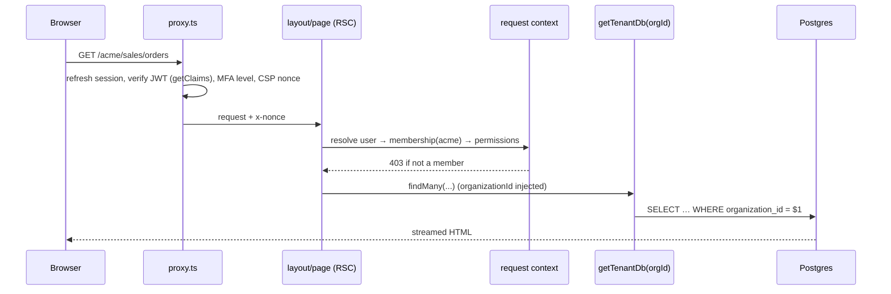
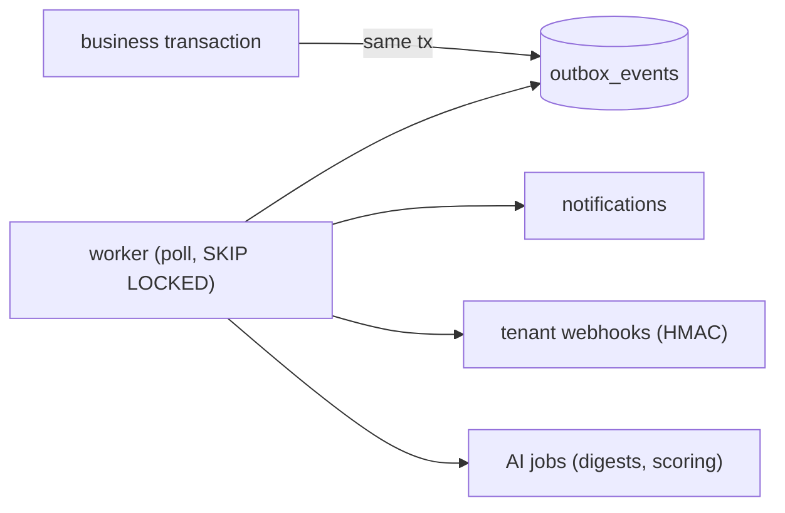

# Data flows

## 1. Page read (server component)

## 2. Write (server action)

1. Parse input with Zod. Reject with field errors.
2. `authorize(ctx, permission)`. Throws a 403.
3. Load the aggregate with the tenant client and check its `version` (optimistic lock).
4. Apply domain rules from `@ai-ems/domain` (state machine, pricing).
5. Inside one `prisma.$transaction`:
   - write the rows
   - allocate the document number
   - insert the `audit_events` row
   - insert the `outbox_events` row
6. `revalidatePath` / `updateTag`. The client cache updates via Realtime invalidation.

## 3. Domain events (Phase 5)

Delivery is at-least-once. Consumers are idempotent (keyed by event id).

## 4. Files

1. The browser asks for an upload.
2. The server checks permission and issues a signed upload URL for `org_id/entity/id/…`.
3. The browser uploads directly to Storage.
4. The server records an `attachments` row.

Downloads always use short-lived signed URLs.

## 5. AI (Phase 21)

1. The user's question goes to a server route.
2. The route calls the AI service with the user's permissions and tenant.
3. The model calls read tools. These tools use the same tenant-scoped, permission-checked services as the UI.
4. The response streams back to the user.
5. Any write comes back as a _proposal_ that the user must confirm.
6. The confirmed write is audited as `actor=AI, approvedBy=user`.
