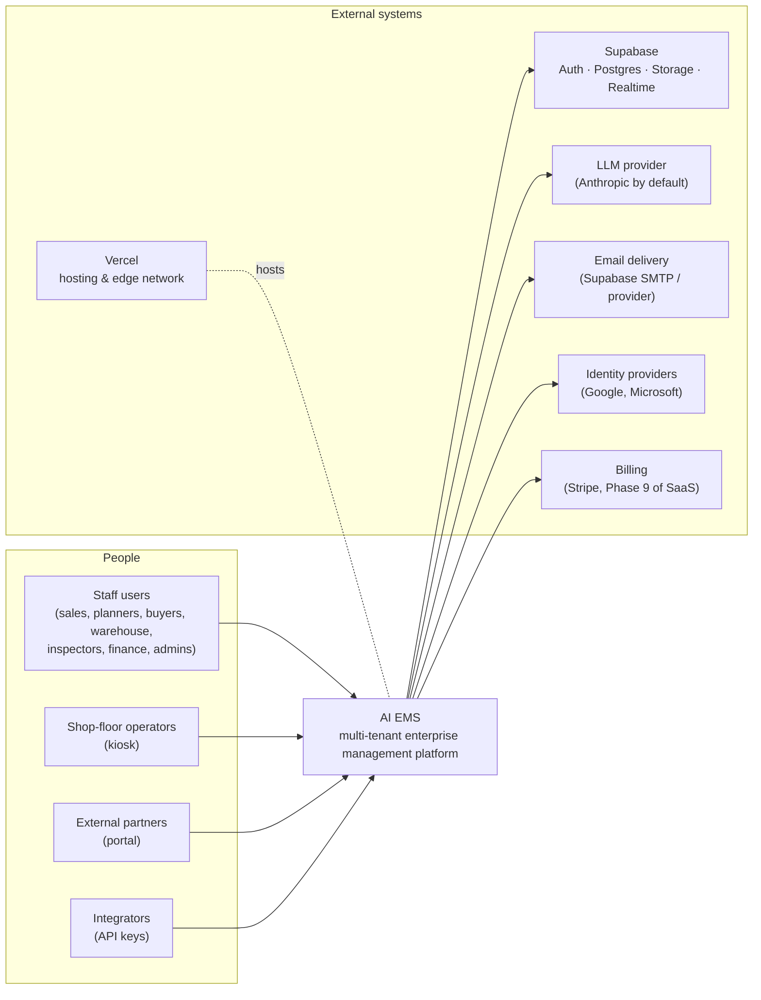

# System context (C4 level 1)

| Actor or system | Interaction                                                                        | Trust boundary           |
| --------------- | ---------------------------------------------------------------------------------- | ------------------------ |
| Staff users     | Browser. Session cookie from Supabase Auth, MFA optional per tenant.               | Internet → edge          |
| Operators       | Shared kiosk device, short sessions, limited permissions                           | Internet → edge          |
| Partners        | Separate portal routes, partner-scoped permissions                                 | Internet → edge          |
| Integrators     | REST `/api/v1` with hashed, scoped, revocable API keys                             | Internet → edge          |
| Supabase        | Pooled Postgres (Prisma), Auth, Storage (signed URLs), Realtime                    | Server → managed service |
| LLM provider    | Server-side only. Prompts are minimised and redacted, never sent from the browser. | Server → third party     |
